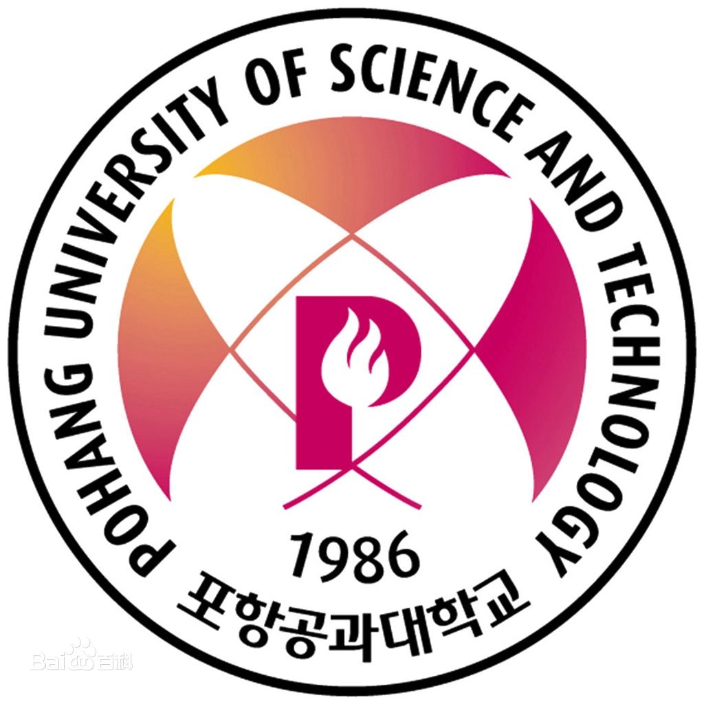
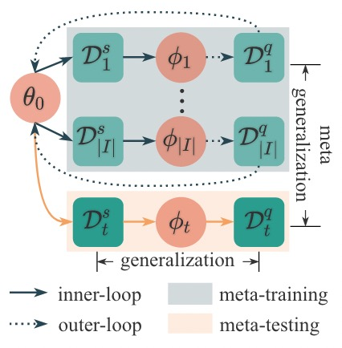
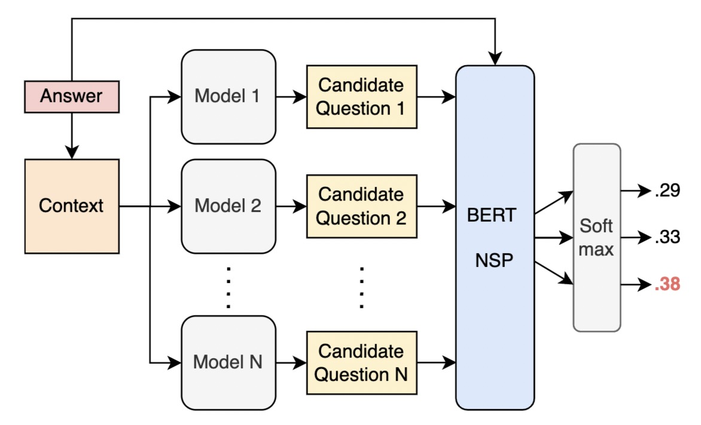

I am Shixiang WANG,  a master student at [City University of Hong Kong](https://www.cityu.edu.hk/). My research interests include  meta-learning, natural language processing and applied machine learning.

I laid a solid foundation in meta-learning in doing my master research project, supervised by Dr. [Ying WEI](https://scholars.cityu.edu.hk/en/persons/ying-wei(ae416bf0-2939-4f54-b392-841ea9426378).html). I also spent wonderful time doing research with CityU NLP group under the supervision of Dr. [Linqi SONG](https://scholars.cityu.edu.hk/en/persons/linqi-song(a665d7a3-8847-404d-a56a-2b10b470327c).html), studying the question generation. Previously, I interned at [Cambricon](https://cambricon.com/) as an algorithm researcher and [JD.com](https://corporate.jd.com/) as an SDE.

<strong>I am looking for a Ph.D. position starting from 2023 Spring/Fall! I am passionate about NLP, Meta-learning and Machine Learning. If you have any helpful information, please contact me! Thank you very much!</strong>

## Education

   <table style="width:100%;border:0px;border-spacing:0px;border-collapse:separate;margin-right:auto;margin-left:auto;">
                <tbody>
                    <tr>
                        <td style="padding:20px;width:30%;vertical-align:middle">
                            
                        </td>
                        <td style="padding:20px;width:100%;vertical-align:middle">
                            <a href="https://www.cityu.edu.hk/">
                                <papertitle>City University of Hong Kong, Hong KongSAR</papertitle>
                            </a>
                            

                            <em>MSc in Computer Science (with distinction)</em>   2021.08 - 2022.10(expected)
                            

                            <strong>CGPA:</strong>3.75/4.3
                            
Courses: Machine Learning: Principles and Practice (A), Natural Language Processing (A), Data Warehousing and Data Mining (A+), Artificial Intelligence (A), Data Management and Artifitial Intelligence (100/100), Data Engineering (A-) 

                        </td>
                    </tr>
                     <tr>
                        <td style="padding:20px;width:30%;vertical-align:middle">
                            
                        </td>
                        <td style="padding:20px;width:100%;vertical-align:middle">
                            <a href="https://www.postech.ac.kr/eng/">
                                <papertitle>Pohang University of Science and Technology, Korea</papertitle>
                            </a>
                            

                            <em>Exchange student in mathematics department</em>   2019.09 - 2019.12
                            
Courses: Data Science, Acturial mathematics, English writing 

                        </td>
                    </tr>
                    <tr>
                        <td style="padding:20px;width:30%;vertical-align:middle">
                            
                        </td>
                        <td style="padding:20px;width:100%;vertical-align:middle">
                            <a href="http://en.hit.edu.cn/">
                                <papertitle>Harbin Institute of Technology, China</papertitle>
                            </a>
                            

                            <em>BSc in Information and Computing</em>   2016.09 - 2020.06
                            

                            <strong>CGPA:</strong>86.35/100
                            
Courses: Probability and Statistics(96), Numerical Methods of Partial Differential Equation(96), Numerical Analysis(92), Operations Research(100), Equations of Mathematical Physics(91), Elements of Information Science(96), Preliminary Functional Analysis(98), Function of Complex Variable(97), Topology(93), C Language(90), Computer Network Technology and Applications(90) 

                        </td>
                    </tr>
                </tbody>
            </table>

## Research Project

 <table style="width:100%;border:0px;border-spacing:0px;border-collapse:separate;margin-right:auto;margin-left:auto;">
                <tbody>
                    <tr>
                        <td style="padding:20px;width:30%;vertical-align:middle">
                            
                        </td>
                        <td style="padding:20px;width:100%;vertical-align:middle">
                            <papertitle>MetaDrug: An Improved Gradient-based Meta-Learning algorithm for Large Scale Drug Discovery</papertitle>
                            

                            2022.01-2022.08 
                             
                            Supervised by <a href="https://scholars.cityu.edu.hk/en/persons/ying-wei(ae416bf0-2939-4f54-b392-841ea9426378).html">Dr. Ying WEI</a>
                             
                            <ul style="padding-left:20px;margin:5px">
                                <li>
                                   Proposed the Metadrug algorithm and test it on a new drug discovery benchmark.
                                </li>
                                <li>
                                   Introduce the MetaPES training stratrgy which do alleviate the overfitting problem in meta learning without increasing training time.
                                </li>
                                <li>
                                   Use the statistic information from the training data to improve the algorithm’s performance on drug activity predictions.
                                </li>
                            </ul>
                        </td>
                    </tr>
                     <tr>
                        <td style="padding:20px;width:30%;vertical-align:middle">
                            
                        </td>
                        <td style="padding:20px;width:100%;vertical-align:middle">
                            <papertitle>Question Generation: Finetuned on Pretrained with QA-Pair Evaluation</papertitle>
                            

                            2022.03-2022.04 
                             
                            Supervised by <a href="https://scholars.cityu.edu.hk/en/persons/linqi-song(a665d7a3-8847-404d-a56a-2b10b470327c).html">Dr. Linqi Song</a>
                             
                            <a href="../files/IDL.pdf">pdf</a> | <a href="../files/IDL_ppt.pdf">slides</a>
                             
                            <ul style="padding-left:20px;margin:5px">
                                <li>
                                   Research on answer‑guided question generation using pretrained models including BART, GPT‑2, and T5.
                                </li>
                                <li>
                                   Design an algorithm that finetunes a BERT with NSP-head on the SQUAD dataset.
                                </li>
                                <li>
                                   The result shows noticeable improvement on evaluation metrics including BLEU, ROUGE, and METEOR.
                                </li>
                            </ul>
                        </td>
                    </tr>
                    </tbody>
            </table>
