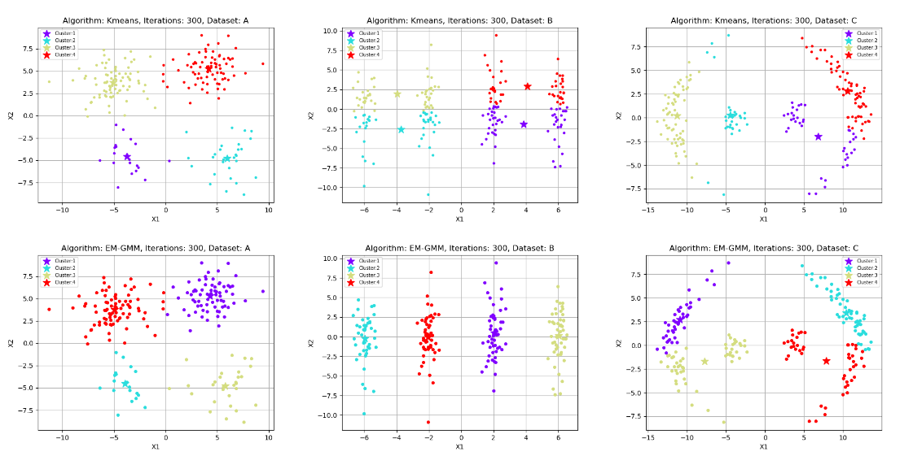
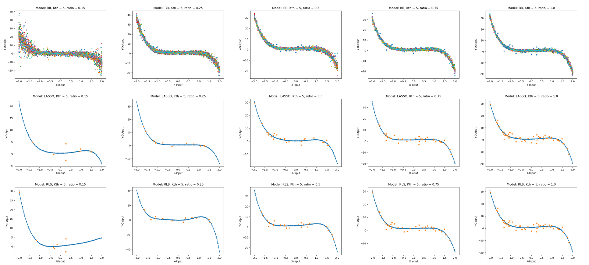

I am Shixiang WANG,  a master student at [City University of Hong Kong](https://www.cityu.edu.hk/). My research interests include  meta-learning, natural language processing and applied machine learning.

I laid a solid foundation in meta-learning in doing my master research project, supervised by Dr. [Ying WEI](https://scholars.cityu.edu.hk/en/persons/ying-wei(ae416bf0-2939-4f54-b392-841ea9426378).html). I also spent wonderful time doing research with CityU NLP group under the supervision of Dr. [Linqi SONG](https://scholars.cityu.edu.hk/en/persons/linqi-song(a665d7a3-8847-404d-a56a-2b10b470327c).html), studying the question generation. Previously, I interned at [Cambricon](https://cambricon.com/) as an algorithm researcher and [JD.com](https://corporate.jd.com/) as an SDE.

<strong>I am looking for a Ph.D. position starting from 2023 Spring/Fall! I am passionate about NLP, Meta-learning and Machine Learning. If you have any helpful information, please contact me! Thank you very much!</strong>

## Education

   <table style="width:100%;border:0px;border-spacing:0px;border-collapse:separate;margin-right:auto;margin-left:auto;">
                <tbody>
                    <tr>
                        <td style="padding:20px;width:30%;vertical-align:middle">
                            
                        </td>
                        <td style="padding:20px;width:100%;vertical-align:middle">
                            <a href="https://www.cityu.edu.hk/">
                                <papertitle>City University of Hong Kong, Hong KongSAR</papertitle>
                            </a>
                            

                            <em>MSc in Computer Science (with distinction)</em>   2021.08 - 2022.10(expected)
                            

                            <strong>CGPA:</strong>3.75/4.3
                            
Courses: Machine Learning: Principles and Practice (A), Natural Language Processing (A), Data Warehousing and Data Mining (A+), Artificial Intelligence (A), Data Management and Artifitial Intelligence (100/100), Data Engineering (A-) 

                        </td>
                    </tr>
                     <tr>
                        <td style="padding:20px;width:30%;vertical-align:middle">
                            
                        </td>
                        <td style="padding:20px;width:100%;vertical-align:middle">
                            <a href="https://www.postech.ac.kr/eng/">
                                <papertitle>Pohang University of Science and Technology, Korea</papertitle>
                            </a>
                            

                            <em>Exchange student in mathematics department</em>   2019.09 - 2019.12
                            
Courses: Data Science, Acturial mathematics, English writing 

                        </td>
                    </tr>
                    <tr>
                        <td style="padding:20px;width:30%;vertical-align:middle">
                            
                        </td>
                        <td style="padding:20px;width:100%;vertical-align:middle">
                            <a href="http://en.hit.edu.cn/">
                                <papertitle>Harbin Institute of Technology, China</papertitle>
                            </a>
                            

                            <em>BSc in Information and Computing</em>   2016.09 - 2020.06
                            

                            <strong>CGPA:</strong>86.35/100
                            
Courses: Probability and Statistics(96), Numerical Methods of Partial Differential Equation(96), Numerical Analysis(92), Operations Research(100), Equations of Mathematical Physics(91), Elements of Information Science(96), Preliminary Functional Analysis(98), Function of Complex Variable(97), Topology(93), C Language(90), Computer Network Technology and Applications(90) 

                        </td>
                    </tr>
                </tbody>
            </table>

## Research Project

 <table style="width:100%;border:0px;border-spacing:0px;border-collapse:separate;margin-right:auto;margin-left:auto;">
                <tbody>
                    <tr>
                        <td style="padding:20px;width:30%;vertical-align:middle">
                            
                        </td>
                        <td style="padding:20px;width:100%;vertical-align:middle">
                            <papertitle>MetaDrug: An Improved Gradient-based Meta-Learning algorithm for Large Scale Drug Discovery</papertitle>
                            

                            2022.01-2022.08 
                             
                            Supervised by <a href="https://scholars.cityu.edu.hk/en/persons/ying-wei(ae416bf0-2939-4f54-b392-841ea9426378).html">Dr. Ying WEI</a>
                             
                            <ul style="padding-left:20px;margin:5px">
                                <li>
                                   Proposed the Metadrug algorithm and test it on a new drug discovery benchmark.
                                </li>
                                <li>
                                   Introduce the MetaPES training stratrgy which do alleviate the overfitting problem in meta learning without increasing training time.
                                </li>
                                <li>
                                   Use the statistic information from the training data to improve the algorithm’s performance on drug activity predictions.
                                </li>
                            </ul>
                        </td>
                    </tr>
                     <tr>
                        <td style="padding:20px;width:30%;vertical-align:middle">
                            
                        </td>
                        <td style="padding:20px;width:100%;vertical-align:middle">
                            <papertitle>Question Generation: Finetuned on Pretrained with QA-Pair Evaluation</papertitle>
                            

                            2022.03-2022.04 
                             
                            Supervised by <a href="https://scholars.cityu.edu.hk/en/persons/linqi-song(a665d7a3-8847-404d-a56a-2b10b470327c).html">Dr. Linqi Song</a>
                             
                            <a href="../files/Finetuned on Pretrained with QA-pair Evaluation.pdf">pdf</a> | <a href="https://doc-3s-5c-drive-data-export.googleusercontent.com/download/cqq4pigaodii7rrvb2tp41rtigceqkto/0l4nb0d088a0q3b8ai0qsldcrlf64q7s/1660104000000/b64f9815-1056-4641-b583-6f70b5478143/106127123270711666763/ADt3v-MEPPQ0_WqOqOKwraF-kfGPrZfDRUDu73MZh48SUeskWWh0d2fx0JSGe2aeF25HiJPVJISgChpKuLoRdz1smZ5okx-UGVQhzhwhe94QaJbuHfXV7-N2qTXcbiBiujkUNOBY5atMSPhSoo7i5pIWwcR4qofYJEYLmmLLC1tp4NqMfOx0GI5p5Tywa4kmyOcZGlTynEAWqypOyJ35fl70WYzQkypVH_giAJXKmuTx99RJhTlf0VRHUs-NDSXN37B4qiun5cgxB4LXLjlZ7c4ChP5aK2RTYYSnwVf_hzE488n0-fXFCzts3aSHKLfwnt4Xe9_9G3IT?authuser=0&nonce=vb34phvq3i61u&user=106127123270711666763&hash=s1oplv580ri3d535hq4hlgfnrqi3u5ss">slides</a>｜<a href="https://github.com/isDanielWang/question_generation">code</a>
                             
                            <ul style="padding-left:20px;margin:5px">
                                <li>
                                   Research on answer‑guided question generation using pretrained models including BART, GPT‑2, and T5.
                                </li>
                                <li>
                                   Design an algorithm that finetunes a BERT with NSP-head on the SQUAD dataset.
                                </li>
                                <li>
                                   The result shows noticeable improvement on evaluation metrics including BLEU, ROUGE, and METEOR.
                                </li>
                            </ul>
                        </td>
                    </tr>
                    </tbody>
            </table>
            
## Course Project

 <table style="width:100%;border:0px;border-spacing:0px;border-collapse:separate;margin-right:auto;margin-left:auto;">
                <tbody>
                                       <tr>
                        <td style="padding:20px;width:30%;vertical-align:middle">
                            
                        </td>
                        <td style="padding:20px;width:100%;vertical-align:middle">
                            <papertitle>Sentiment analysis, Course Kaggle Competition</papertitle>
                            

                            2021.10
                             
                            Supervised by <a href="https://scholars.cityu.edu.hk/en/persons/antoni-bert-chan(4f4a27a4-fd63-4ee5-b64e-4e34b764027a).html">Prof. CHAN Antoni Bert</a>
                             
                           <a href="https://github.com/isDanielWang/Tweet-Sentiment-Analysis/blob/main/Tweet%20Sentiment%20Analysis/code/%20Tweet%20Sentiment%20Analysis.ipynb">code</a>
                            <ul style="padding-left:20px;margin:5px">
                                <li>
                                  The task is predict the sentiment of Tweets about four technology companies, Apple, Microsoft, Google, and Twitter. Here are some examples of tweets with different sentiments.
                                 </li>
                                <li>
                                   Analyze tweet features, remove special symbols, common words, and lemmatization. Use BOW and TF-IDF to extract dictionaries from the cleaned data and vectorize the training text.
                                </li>
                                <li>
                                   Use Naive Bayes, Logistic regression, SVM, Adaboost, etc. to train separately, and use grid search to select the optimal value of hyperparameters.
                                </li>
                            </ul>
                        </td>
                    </tr>
                  <tr>
                        <td style="padding:20px;width:30%;vertical-align:middle">
                            
                        </td>
                        <td style="padding:20px;width:100%;vertical-align:middle">
                            <papertitle>Handwritten Digits Classification</papertitle>
                            

                            2022.05
                             
                            Supervised by <a href="https://scholars.cityu.edu.hk/en/persons/antoni-bert-chan(4f4a27a4-fd63-4ee5-b64e-4e34b764027a).html">Prof. CHAN Antoni Bert</a>
                             
                            <a href="../files/Handwritten Digits Classification-proposal.pdf">proposal</a> | <a href="../files/Handwritten Digits Classification.pdf">pdf</a> | <a href="https://github.com/isDanielWang/Digits_Classification/blob/main/src/classification.ipynb">code</a>
                             
                            <ul style="padding-left:20px;margin:5px">
                                <li>
                                   Explored on the effectiveness of an emsemble of Shallow CNN models.
                                </li>
                                <li>
                                   Evaluated the effect of kernel size versus performance.
                                </li>
                                <li>
                                   The average challenge score is 0.94.
                                </li>
                            </ul>
                        </td>
                    </tr>
                    <tr>
                        <td style="padding:20px;width:30%;vertical-align:middle">
                            
                        </td>
                        <td style="padding:20px;width:100%;vertical-align:middle">
                            <papertitle>Animal cuteness analysis, Course Kaggle Competition</papertitle>
                            

                            2021.12
                             
                            Supervised by <a href="https://scholars.cityu.edu.hk/en/persons/antoni-bert-chan(4f4a27a4-fd63-4ee5-b64e-4e34b764027a).html">Prof. CHAN Antoni Bert</a>
                             
                            <a href="../files/Pawpularity Contest.pdf">pdf</a> | <a href="../files/PetFinder.pdf">slides</a> | <a href="https://github.com/isDanielWang/PetPawpularity/blob/main/PetPawpularity/CourseProject-2021A.ipynb">code</a>
                            <ul style="padding-left:20px;margin:5px">
                                <li>
                                  In this competition, We analyze raw images and metadata to predict the “Pawpularity” of pet photos. 
                                 </li>
                                <li>
                                   Perform linear regression, ridge regression, LASSO, random forest regression on the provided original features, and use PCA to extract core features. Extract features directly from the original image and apply deep learning models such as CNN. Transfer learning with existing models such as EfficientNetB7
                                </li>
                                <li>
                                   The minimum RMSE after transfer learning of EfficientNetB7 is 20.
                                </li>
                            </ul>
                        </td>
                    </tr>
                    </tbody>
            </table>

## Programming assignment

 <table style="width:100%;border:0px;border-spacing:0px;border-collapse:separate;margin-right:auto;margin-left:auto;">
                <tbody>
                 <tr>
                        <td style="padding:20px;width:30%;vertical-align:middle">
                            
                        </td>
                        <td style="padding:20px;width:100%;vertical-align:middle">
                            <papertitle>Machine Learning Programming Assignment-Clustering</papertitle>
                            

                            2022.03
                             
                            Supervised by <a href="https://scholars.cityu.edu.hk/en/persons/antoni-bert-chan(4f4a27a4-fd63-4ee5-b64e-4e34b764027a).html">Prof. CHAN Antoni Bert</a>
                             
                           <a href="./files/PA-2-clustering.pdf">pdf</a> | <a href="https://github.com/isDanielWang/CS5487-Programming-Assignment-2-Clustering-/blob/main/Report.ipynb">report</a> | <a href="https://github.com/isDanielWang/CS5487-Programming-Assignment-2-Clustering-/blob/main/cluster.py">code</a>
                          
In this programming assignment, I implement and test several clustering algorithms (K-means, EM-GMM, Mean-shift) on both synthetic and real data and examine how each method performs on different configurations of data with only basic libraries.

                        </td>
                    </tr>
                  <tr>
                        <td style="padding:20px;width:30%;vertical-align:middle">
                            
                        </td>
                        <td style="padding:20px;width:100%;vertical-align:middle">
                            <papertitle>Machine Learning Programming Assignment-Regression</papertitle>
                            

                            2022.02
                             
                            Supervised by <a href="https://scholars.cityu.edu.hk/en/persons/antoni-bert-chan(4f4a27a4-fd63-4ee5-b64e-4e34b764027a).html">Prof. CHAN Antoni Bert</a>
                             
                            <a href="../files/PA-1-regression.pdf">pdf</a> | <a href="https://github.com/isDanielWang/CS5487-Programming-Assignment-1-Regression/blob/main/Summary.ipynb">report</a> | <a href="https://github.com/isDanielWang/CS5487-Programming-Assignment-1-Regression/blob/main/P1_model.py">code</a>
                             
                          
In this programming assignment, I first implement and test some of the regression methods (least-squares, regularized LS, L1-regularized LS, robust regression, Bayesian regression) based on the basic libraries. I also estimate the number of people in an image using the above regression methods and do analysis.

                        </td>
                    </tr>
                    </tbody>
            </table>
